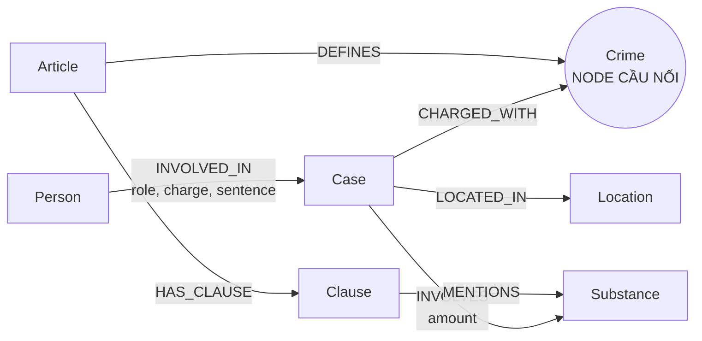

# Thiết kế Ontology — Day 19

**Họ tên:** Dương Thị Ngân 
**MSSV:** 2A202602808

**Lựa chọn:**
- [x] Dùng ontology gợi ý (có bổ sung cách truy hồi theo câu hỏi)
- [ ] Tự thiết kế (xét bonus +15)

## 1. Sơ đồ

`Crime` nối KB tin tức với KB luật. `Substance` là cầu nối phụ, dùng để chọn khoản luật theo chất và trả lời câu tổng hợp.

## 2. Entity types (node labels)

| Label | Ý nghĩa | Khóa định danh (`MERGE` theo) | Properties chính | KB | Trích bằng |
| --- | --- | --- | --- | --- | --- |
| `Article` | Điều luật | `id` | `title`, `law`, `doc_id` | Luật | Regex/front matter |
| `Clause` | Khoản trong điều luật | `id` | `number`, `penalty`, `text`, `doc_id` | Luật | Regex |
| `Crime` | Tội danh chuẩn hóa | `name` | `name` | Dùng chung | Regex ở luật; LLM + `link_entity` ở tin |
| `Case` | Một vụ việc/vụ án | `name` | `summary`, `date`, `doc_id`, `source_title` | Tin | LLM JSON |
| `Person` | Người xuất hiện trong vụ việc | `name` | `aliases` | Tin, có thể dùng chung | LLM JSON |
| `Substance` | Chất ma túy | `name` | `name` | Dùng chung | Danh sách chuẩn + regex/LLM |
| `Location` | Địa điểm của vụ việc | `name` | `name` | Tin, có thể dùng chung | LLM JSON |

## 3. Relationships

| Type | Từ → Đến | Properties trên cạnh | Ý nghĩa |
| --- | --- | --- | --- |
| `DEFINES` | `Article` → `Crime` | — | Điều luật định nghĩa tội danh |
| `HAS_CLAUSE` | `Article` → `Clause` | — | Điều luật có các khoản |
| `MENTIONS` | `Clause` → `Substance` | — | Khoản nhắc tới loại chất |
| `CHARGED_WITH` | `Case` → `Crime` | — | Vụ việc gắn với tội danh |
| `INVOLVED_IN` | `Person` → `Case` | `role`, `charge`, `sentence` | Vai trò, cáo buộc và mức án của người trong vụ |
| `INVOLVES` | `Case` → `Substance` | `amount` | Chất và khối lượng trong vụ |
| `LOCATED_IN` | `Case` → `Location` | — | Địa điểm xảy ra/xử lý vụ việc |

## 4. Node cầu nối giữa hai KB

- **Node chính:** `Crime`.
- **Lý do:** tin tức thường nêu tội danh, còn mỗi Điều BLHS định nghĩa đúng một tội danh. Nhờ vậy đường `Case → Crime ← Article` đưa được dữ kiện vụ án sang căn cứ pháp luật.
- **Cách khớp tên:** chuẩn hóa chữ thường, bỏ tiền tố “Tội”, khớp chính xác trước; nếu chưa khớp thì dùng `difflib.get_close_matches` với `cutoff=0.8`. Prompt trích xuất chỉ cho LLM chọn từ danh sách tội chuẩn lấy từ KB luật.
- **Khi cầu gãy:** bài báo không nêu tội, LLM trả tên ngoài danh sách hoặc JSON lỗi. Hệ thống không nối bừa khi độ giống thấp; cần xem lại output trích xuất và bổ sung alias/prompt.
- **Cầu phụ:** `Substance` nối `Case → Substance ← Clause`, giúp chọn khoản luật liên quan tới MDMA, Ketamine…

## 5. Competency questions

| Câu | Đường đi trên graph | Trả lời được? |
| --- | --- | --- |
| Q1 | `Article(doc_id='pcmt-dieu-2')-[:HAS_CLAUSE]->Clause` kết hợp chunk luật | Có; định nghĩa nằm trong văn bản luật được vector search lấy ra. |
| Q2 | `Person-[:INVOLVED_IN]->Case(doc_id của bài 36kg)` | Có; tên người và mức án nằm trên quan hệ/ngữ cảnh tin. |
| Q3 | `Person('Lê Minh Thành')-[:INVOLVED_IN]->Case-[:CHARGED_WITH]->Crime<-[:DEFINES]-Article-[:HAS_CLAUSE]->Clause(number=1)` | Có; nối mức án trong tin với Điều 251 và khung cơ bản. |
| Q4 | `Person/alias('Hoàng Nato')-[:INVOLVED_IN]->Case-[:CHARGED_WITH]->Crime<-[:DEFINES]-Article-[:HAS_CLAUSE]->Clause` | Có; khi hỏi “tối đa”, truy hồi toàn bộ khoản để lấy khung cao nhất. |
| Q5 | `Person('Cái Quang Huy')→Case→Crime←Article→Clause` và `Case→Substance←Clause` | Có; MDMA chọn khoản 4 Điều 250. |
| Q6 | `Substance('MDMA')<-[:INVOLVES]-Case<-[:INVOLVED_IN]-Person` | Có; truy hồi tất cả vụ liên quan tới MDMA, không chỉ top-k vector. |

## 6. Quyết định thiết kế và đánh đổi

1. **Luật dùng regex, tin dùng LLM.** Luật có cấu trúc Điều/khoản ổn định nên regex rẻ và lặp lại được; dùng LLM cho toàn bộ sẽ tốn tiền và dễ đổi kết quả. Tin là văn xuôi nên regex khó bao quát.
2. **`Crime` làm cầu nối chính.** So với nối trực tiếp bài báo vào Điều luật, node tội danh dễ kiểm tra và tái sử dụng cho nhiều vụ. Đổi lại, nếu chuẩn hóa tội sai thì cả đường xuyên hai KB bị gãy.
3. **Chỉ lấy khoản 1 và khoản có chất trùng với vụ; câu hỏi “tối đa/cao nhất” lấy toàn bộ khoản.** Cách này giảm token ở câu thông thường nhưng vẫn trả lời được câu hỏi về khung cao nhất.
4. **Dùng `Substance` làm cầu phụ và aggregation seed.** Nó giúp Q5/Q6 không phụ thuộc hoàn toàn vào top-k vector, nhưng tên chất phải được chuẩn hóa thống nhất.

## 7. So với ontology gợi ý

Không xét bonus; graph giữ nguyên các label và quan hệ gợi ý. Phần cải tiến nằm ở chiến lược truy hồi KG-3: hỗ trợ câu tổng hợp theo `Substance` và tín hiệu “tối đa/cao nhất”.

## 8. Hạn chế còn lại

`Case` và `Person` vẫn MERGE theo tên do LLM tạo nên có nguy cơ trùng hoặc gộp nhầm. `Substance` chưa có bảng alias đầy đủ. Ontology cũng chưa biểu diễn ngưỡng khối lượng thành node/property có kiểu số, nên việc chọn khoản vẫn dựa vào chất và nội dung văn bản thay vì suy luận định lượng hoàn toàn.
